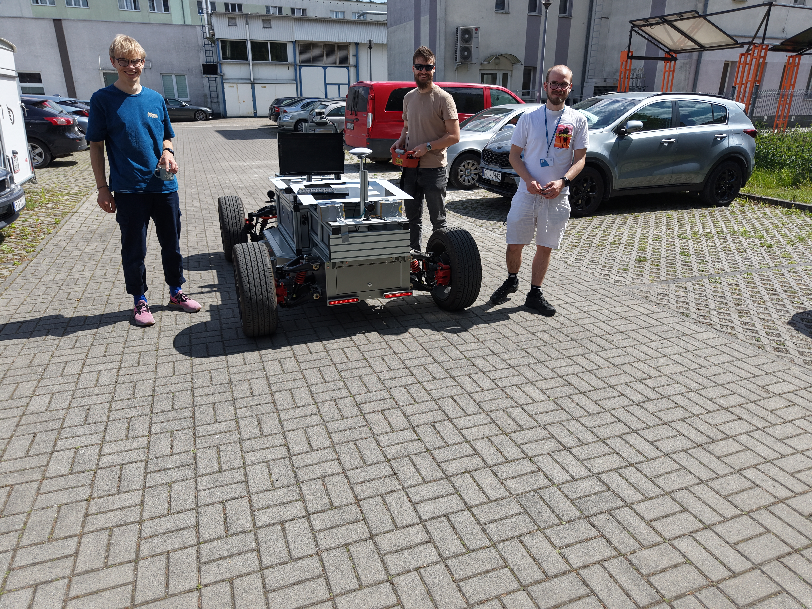
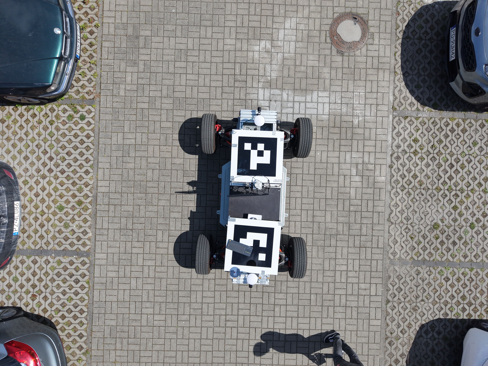
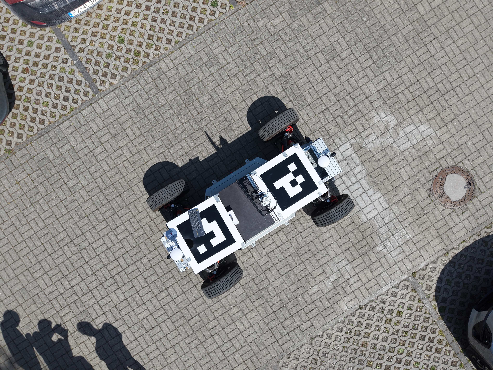
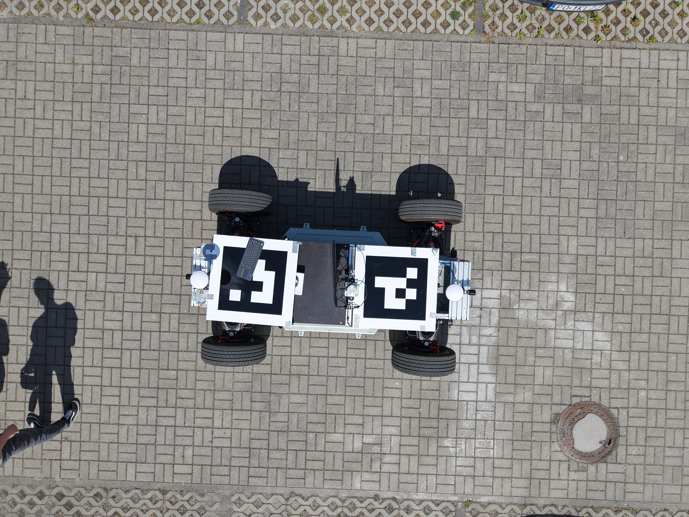

# Drone-Car Synchronization Platform
The dataset and code in this project enable the analysis of drone and vehicle data for temporal and spatial synchronization between the sources, using ArUco markers.
The main application is relative localization of the vehicle based on image and positioning data.



## Input Data

> **Note:** If you want to use our data, just request it from the collaborators.

## How to use?

1. If you have folder with photos from drone, you need to extract exif data form photos with command:
```bash
python3 src/extract_metadata.py folder-with-photos
```
2. After created `.txt` files with `exif` data, we need to export them all to `.csv` file with command:
```bash
python3 src/export_metadata.py folder-with-exifs output-file.csv
```
> **Note:**  All this files will be created in folder with photos.

3. Create `.csv` files extracted from rosbag topic. Each topic choosen = one `.csv` file generated. Do it with this command:
```bash
python3 src/robsag2csv.py rosbag-folder --output-dir output_name_folder --prefix prefix_name
```

4. Create `.csv` file for AprilTags detected on photos. Use this script:
```bash
python3 src/extract_april_tags_center.py input_folder_name output_csv_name --scale 0.5 --min-area 4000
```

5. Connect data, exif_data.csv (from drone) and car_data.csv (from rosbag) to correspond `.csv` file. Choose specific files to connect. Data is connecting with 0.5 second nearest read.
```bash
python3 src/data_connect.py --exif exif_name.csv --rosbag rosbag_name.csv --tags tag_name.csv --output output_dir_name
```

> **Note:** Remeber about time synchonization between drone and car. For our purpouses rosbag data were edited manually in `rosbag2csv.py` script to adding specific time to df['time']

## Test Platform

### DJI Mavic Air 3S Drone

### Ground Platform Pixloop





## Requirements
Python 3.8+

ROS 2 (for using rosbag)

Libraries: `opencv-python`, `pandas`, `numpy`, `pyyaml`

## Authors

Authors: Piotr Zacholski, Maciej Krupka
Operators: Bartosz Ptak (drone), Stanisław Kuczma (ground platform)
Date: June 2025

